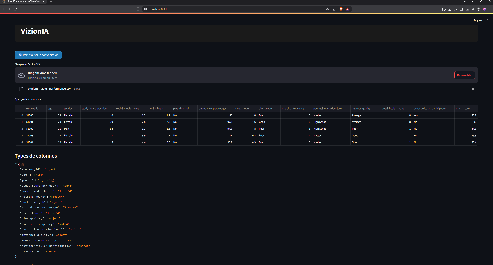
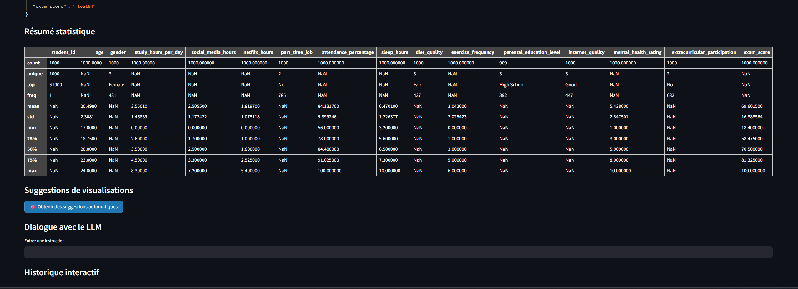

# 📊 VizionIA – Assistant de Visualisation Intelligente

**VizionIA** est une application interactive développée avec **Streamlit** qui vous aide à explorer vos fichiers CSV, obtenir des visualisations automatiques générées par un LLM (modèle de langage), et interagir en langage naturel pour personnaliser vos graphiques.

---

## 🚀 Fonctionnalités principales

- 📂 Upload de fichiers CSV
- 🔍 Résumé automatique des colonnes et statistiques
- 🤖 Suggestions de visualisations pertinentes
- 💬 Dialogue avec un LLM pour créer ou modifier des graphiques
- 🎨 Choix parmi 3 visualisations générées automatiquement
- 🔁 Bouton de régénération des visualisations manquantes
- 🧾 Historique interactif (supprimer, télécharger graphique ou code python)
- 🧠 Interprétation automatique de graphiques
- 🛠️ Modification à la volée via instructions en langage naturel
- 🧪 Tests unitaires + rapport de couverture (`pytest`)

---

## 🖼️ Aperçu de l'application

### 📤 Chargement de fichier + aperçu :


---

### 📈 Résumé statistique + interface interactive :


---

## ⚙️ Installation

```bash
pip install -r requirements.txt
```

---

## ▶️ Lancement de l’application

```bash
python -m streamlit run main.py
```

---

## 🧪 Tests et couverture

### ▶️ Lancer les tests dans le terminal

```bash
python -m pytest tests/
```

### 📊 Générer un rapport de couverture dans le terminal

```bash
python -m pytest --cov=. --cov-report=term --cov-config=.coveragerc
```

### 🌐 Générer un rapport HTML interactif

```bash
python -m pytest --cov=. --cov-report=html --cov-config=.coveragerc
start htmlcov\index.html  # Windows uniquement
```

---

## 👤 Auteurs

- **Touati Malik Abdel Hamid**
- **Touati Kamel**

> TER M1 – Aix-Marseille Université – 2025

---

## 📄 Licence

MIT – Libre pour toute utilisation, modification et distribution.
